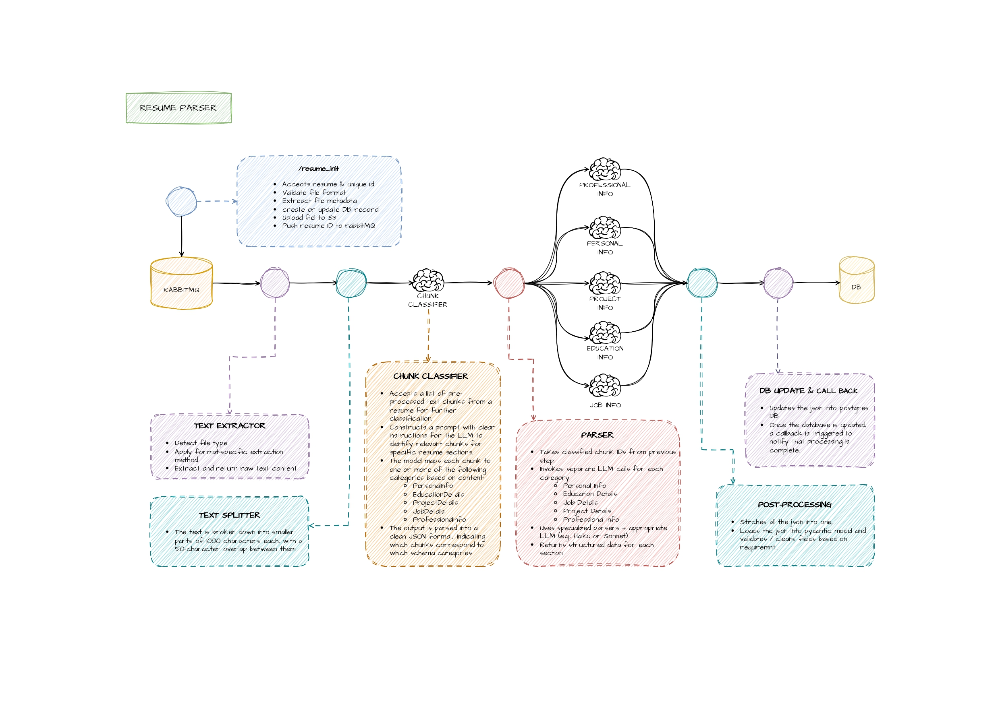

# RESUME PARSER



## Table of Contents
- [Description](#description)
- [Tech Stack](#tech-stack)
- [Workflow](#workflow)
- [Setup](#setup)
- [Testing](#testing)

## Description
This project is a resume parser designed to extract and process information from resumes using machine learning and natural language processing techniques.

## Tech Stack
- Python
- RabbitMQ
- PostgreSQL
- AWS S3
- Docker

## Workflow
1. Resumes are uploaded to the system.
2. The parser processes the resumes and extracts relevant information.
3. Extracted data is stored in a PostgreSQL database.
4. Results are made available for further analysis or integration.

## Setup

### Step 1: Clone the repository
```bash
git clone https://github.com/your-username/resume_parser_lc.git
cd resume_parser_lc
```

### Step 2: Set up `.env` variables
Create a `.env` file in the root directory and add the required environment variables. Refer to `.env.example` for guidance.

### Step 3: Install Docker
Ensure Docker is installed on your system. Follow the [official Docker installation guide](https://docs.docker.com/get-docker/) for your operating system.

### Step 4: Run Docker Compose
Start the application using Docker Compose:
```bash
docker-compose up --build
```
This will set up all necessary services, including the database and message broker.

## Testing
To test the application, ensure all services are running and use the provided test scripts or API endpoints to validate functionality.